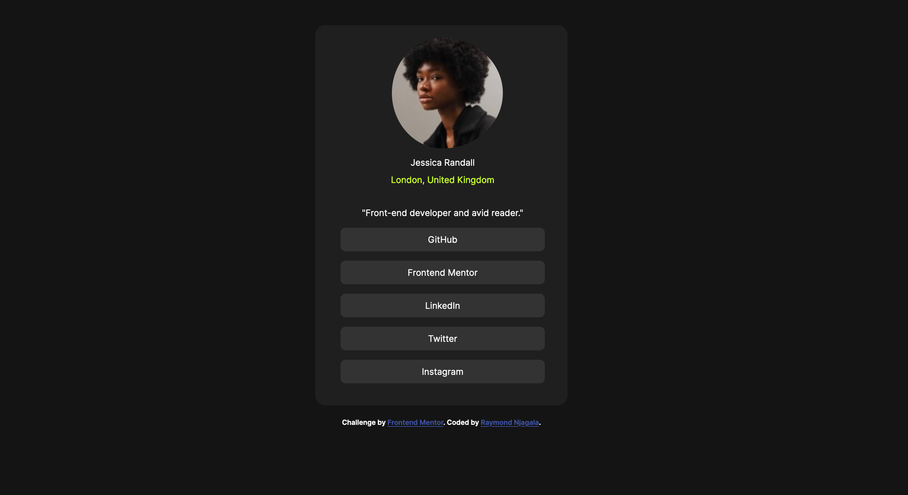

# Frontend Mentor - Social links profile solution

This is a solution to the [Social links profile challenge on Frontend Mentor](https://www.frontendmentor.io/challenges/social-links-profile-UG32l9m6dQ). Frontend Mentor challenges help you improve your coding skills by building realistic projects. 

## Table of contents

  - [The challenge](#the-challenge)
  - [Screenshot](#screenshot)
  - [Links](#links)
- [My process](#my-process)
  - [Built with](#built-with)
  - [What I learned](#what-i-learned)
- [Author](#author)

### The challenge

Users should be able to:

- See hover and focus states for all interactive elements on the page

## Welcome! 👋
## Screenshot

### Links

- Solution URL: [Add solution URL here](https://github.com/Rhyz26/social-profile-links-main.git)
- Live Site URL: [Add live site URL here](https://social-profile-links-main.vercel.app/)

## My process
I started by writing out the HTML, followed with the designing of the html with css, then ended with adding media queries to make the website responsive

### Built with

- Semantic HTML5 markup
- CSS custom properties
- Mobile-first workflow
- CSS box model
- 

### What I learned

I learnt how to manipulate the box model the content
I also learnt how to add media queries

## Author

- Website - [Raymond Njagala](https://personal-portfolio-web-cyan.vercel.app/)
- Frontend Mentor - [@Rhyz26](https://www.frontendmentor.io/profile/Rhyz26)
- Twitter - [@Initial_Rhy](https://twitter.com/Initial_Rhy)
